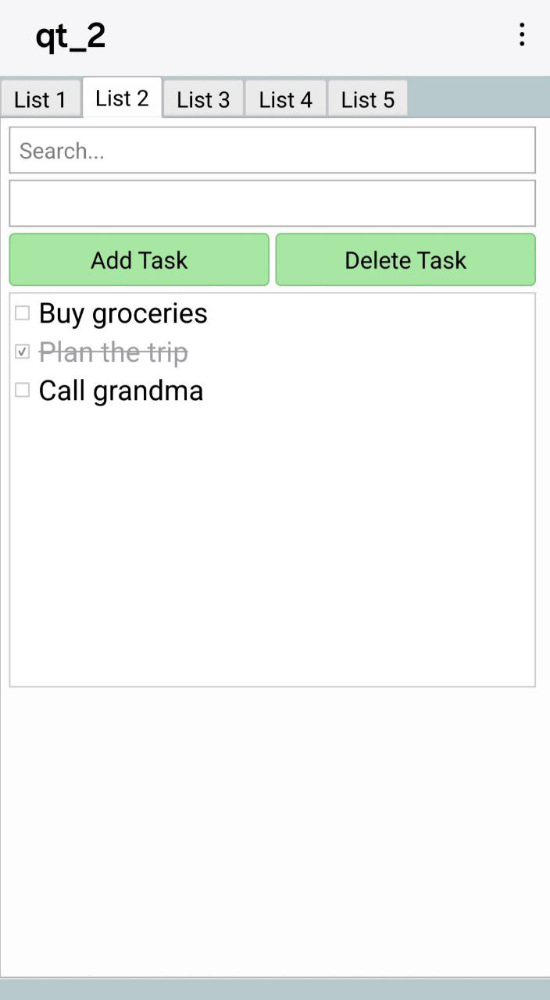
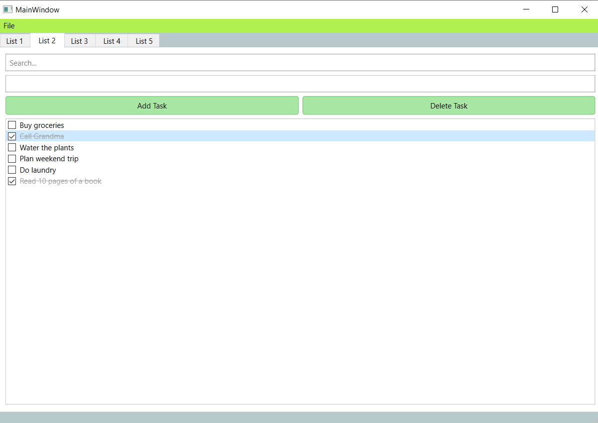

# QtTaskManager

A Task Manager app built with **C++17** and **Qt 6.9.0**, supporting both **Windows desktop** and **Android** platforms. Manage multiple task lists with a responsive UI and persistent storage.


<table>
  <tr>
    <td align="center">
      <br>
      <b>Android</b>
    </td>
    <td align="center">
      <br>
      <b>Windows</b>
    </td>
  </tr>
</table>


---

## Overview

- **Built With**:
  - Qt 6.9.0
  - C++17
  - CMake
  - Qt Creator
  - Android Studio (for APK build)
 

- **Key Features**:
  - Add, delete, and check off tasks
  - Support for multiple task lists via dynamic tabs
  - JSON-based save/load for each tab
  - Real-time task search/filter
  - Visual cues for completed tasks (strike-through, gray text)
  - Responsive layout scaled to screen size
  - Light theme with custom button and UI styling
  - Cross-platform deployment

- **Deployment Info**:
  - Windows build: `Desktop_Qt_6_9_0_MSVC2022_64bit`
  - Android builds:
    - `Android_Qt_6_9_0_Clang_arm64_v8a`
    - `Android_Qt_6_9_0_Clang_x86_64`
  - Windows executable bundled using windeployqt on the compiled .exe file

---

##  Folder Structure

```
QtTaskManager-Windows-Android/
├── CMakeLists.txt
├── main.cpp
├── mainwindow.cpp
├── mainwindow.h
├── mainwindow.ui
├── taskmanager.cpp
├── taskmanager.h
├── README.md
├── images/
│   ├── Android_photo.png
│   └── Windows_photo.png
```

---

##  TODO

- [ ] Task priority levels
- [ ] Due dates and reminders
- [ ] Drag-and-drop task sorting
- [ ] Tab renaming & reordering

---


